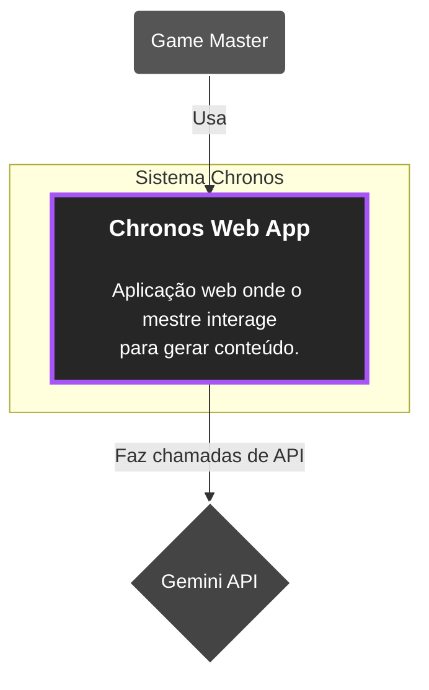

# 🧙 Chronos: Um Assistente Criativo para Mestres de RPG

Chronos é uma plataforma web **open-source**, desenvolvida com **IA Generativa**, projetada para ser a principal ferramenta de apoio para Mestres de Jogos de RPG de mesa (Game Masters). Nosso objetivo é **reduzir drasticamente o tempo de preparação** e o **bloqueio criativo**, permitindo que mestres criem e conduzam aventuras memoráveis com mais facilidade e confiança.

> Este projeto está sendo desenvolvido no contexto da disciplina **[IF1006] Transformação Digital com IA**, do Centro de Informática da UFPE.

---

## 🎯 Objetivos Principais e Funcionalidades

O objetivo estratégico do Chronos é **auxiliar Game Masters**, reduzindo a barreira criativa e o tempo de preparação para criar sessões de RPG imersivas.

### Funcionalidades Esperadas (MVP - "O Construtor")

O Produto Mínimo Viável foca nas ferramentas de **preparação pré-jogo**, atendendo aos maiores pontos de dor dos mestres:

- 🎲 **Gerador de NPCs**  
  Cria personagens não-jogáveis completos a partir de um simples conceito (ex: "taverneiro anão ex-aventureiro"), gerando:
  - Nome
  - Aparência
  - Personalidade
  - Motivação
  - Um segredo para uso em jogo

- 🗺️ **Gerador de Locais**  
  Gera descrições textuais ricas e atmosféricas para cenários como:
  - Tavernas
  - Cidades
  - Florestas
  - Masmorras

- 📜 **Gerador de Missões**  
  Desenvolve "ganchos" de aventura e missões secundárias, incluindo:
  - Objetivo
  - Contratante
  - Reviravolta
  - Recompensas possíveis

---

## 🏗️ Estrutura da Aplicação (Arquitetura)

Utilizamos o **Modelo C4** para documentar a arquitetura da solução, permitindo visualizar o sistema em diferentes níveis de abstração.

### Diagrama Nível 1: Contexto

## 🔗 Tecnologias Utilizadas e Recursos Importantes
📌 Workspace do Projeto: em breve.

📌 Rastreador de Issues (GitHub): em breve.

📌 Kanban Board: em breve.

📌 Front-end: à definir.

📌 Back-end: à definir.

📌 Banco de Dados: à definir.

## 🔗 Build

Em construção.

## 🔗 Contribute

Estamos sempre procurando por novos aventureiros para se juntar à nossa guilda! Se você é um desenvolvedor, designer, ou apenas um entusiasta de RPG com boas ideias, sua contribuição é muito bem-vinda.

Antes de começar, por favor, leia nosso guia de contribuição. Ele detalha nosso processo de submissão de código, padrões de commit, e outras informações importantes para garantir que tenhamos uma colaboração fluida e eficiente.

### Tarefas para Iniciantes

Para facilitar seus primeiros passos, separamos algumas tarefas que são ideais para novos contribuidores, elas são um ótimo jeito de se familiarizar com o projeto.

